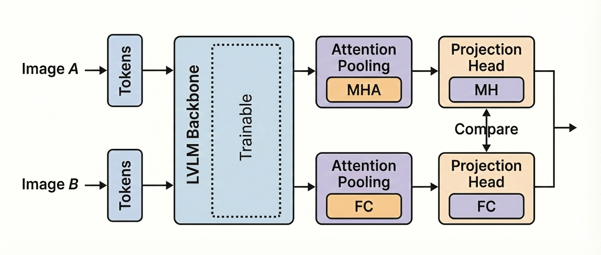
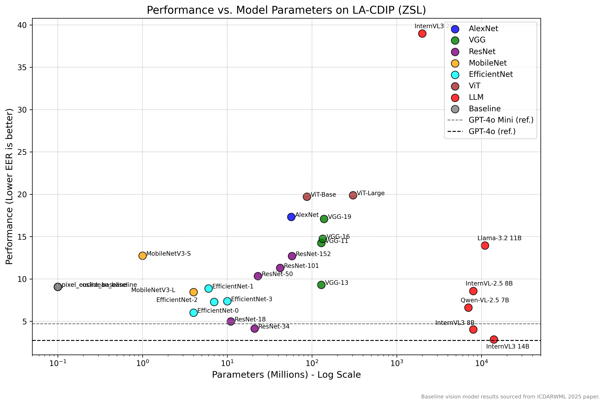

# CaVL-Doc: Comparative Aligned Vision-Language Document Embeddings

[](https://opensource.org/licenses/MIT)
[](https://arxiv.org/abs/2510.12345) [](https://github.com/jpcosta90/LA-CDIP)
[](https://www.cs.cmu.edu/~aharley/rvl-cdip/)

This repository implements **CaVL-Doc**, an architecture and finetuning pipeline designed to generate **Comparative Aligned Vision-Language Document Embeddings**. The goal is to optimize a Large Vision-Language Model (LVLM) to produce high-quality, unified document representations for tasks requiring robust **similarity comparison** and **zero-shot document classification**.

The pipeline is built on the **Autoregressive Multimodal Pre-Training** paradigm (similar to InternVL3), where image patches are processed as tokens alongside text. Our core contribution lies in optimizing the output layer to learn a high-quality embedding space via **Supervised Metric Learning** (supporting Contrastive, ArcFace, and other comparative losses).

---

## CaVL-Doc Architecture and Strategy

CaVL-Doc focuses exclusively on enhancing the **representation quality** of the LVLM's output feature vector for document retrieval tasks.



The system utilizes a frozen, pre-trained LVLM (e.g., InternVL3) and fine-tunes it using a **Teacher-Student Curriculum Learning** strategy.

* **The Student (CaVL Model):** A projection head attached to the frozen LVLM learns to map multimodal tokens into a compact embedding space optimized for comparison (Euclidean/Cosine).
* **The Teacher (RL Policy):** A Reinforcement Learning agent selects the most informative training pairs ("hard negatives") to maximize the Student's learning efficiency.

---

## Repository Structure

The project is structured as a reusable Python package (`cavl_doc`).

```
.
├── checkpoints/              # Stores fine-tuned models (best_siam.pt)
├── data/                     # Datasets (LA-CDIP, RVL-CDIP) and pair files
├── analysis/                 # Stores CSV files related to error analysis
├── results/                  # Stores master result logs and generated plots
├── scripts/                  # Executable Python scripts
│   ├── run_cavl_training.py  # Main training loop (RL + CaVL Model)
│   ├── run_siamese_eval.py   # Evaluation script for trained checkpoints
│   └── update_readme.py      # Utility to update this README with new results
└── src/                      # Source code library
    ├── cavl_doc/             # The 'cavl-doc' Python module
    │   ├── __init__.py
    │   ├── models/           # Model definitions (CaVLModel, Policy, Backbone)
    │   ├── modules/          # Building blocks (Heads, Poolers, Losses)
    │   ├── trainers/         # Training loops
    │   ├── data/             # Dataset classes
    │   └── utils/            # Helpers and visualization
```

---

## Installation

1.  **Clone the repository:**
    ```bash
    git clone https://github.com/jpcosta90/CaVL-Doc.git 
    cd CaVL-Doc
    ```

2.  **Set up a virtual environment and install dependencies:**
    ```bash
    python -m venv venv
    source venv/bin/activate
    pip install -r requirements.txt
    ```

3.  **Install the project in editable mode** (Critical for imports to work):
    ```bash
    pip install -e .
    ```

4.  **Download Datasets:**
    * Place the document image datasets (LA-CDIP, RVL-CDIP) and their respective pair files inside the `data/` directory.

---

## Usage & Experimental Workflow

### 1. Training the CaVL Model (`run_cavl_training.py`)

This script runs the Siamese RL-based training loop. It freezes the backbone and trains the Projection Head (and optionally specified layers) using the Teacher-Student curriculum.

```bash
python scripts/run_cavl_training.py \
    --dataset-name "RVL-CDIP" \
    --model-name "InternVL3-2B" \
    --pairs-csv "data/RVL-CDIP/train_pairs.csv" \
    --base-image-dir "/path/to/images/" \
    --training-sample-size 2000 \
    --epochs 5 \
    --projection-output-dim 512 \
    --student-batch-size 4
```
* **Output:** Saves the best model to `checkpoints/` (e.g., `best_siam.pt`).

### 2. Evaluating Embeddings (`run_siamese_eval.py`)

Evaluate a trained checkpoint on a validation or test set. This script automatically detects the model configuration from the checkpoint file.

```bash
python scripts/run_siamese_eval.py \
    --pairs-csv "data/RVL-CDIP/test_pairs.csv" \
    --base-image-dir "/path/to/images/" \
    --checkpoint-path "checkpoints/Your_Experiment/best_siam.pt" \
    --metric "euclidean" \
    --plot
```
* **Output:** Generates density plots in `results/plots` and a results CSV.

### 3. Updating Results (`update_readme.py`)

To regenerate the tables and plots below based on the latest experiments:

```bash
python scripts/update_readme.py
```

---

## Results

### LA-CDIP Results

| Method                |   EER (%) | Model/Adapter   | Metric   | Link Figura                                             |
|:----------------------|----------:|:----------------|:---------|:--------------------------------------------------------|
| pixel_cosine_baseline |      9.07 | Baseline        | cosine   | [Link](results/plots/LA-CDIP_pixel_cosine_baseline.png) |

### RVL-CDIP Results

| Method                |   EER (%) | Model/Adapter   | Metric   | Link Figura                                              |
|:----------------------|----------:|:----------------|:---------|:---------------------------------------------------------|
| pixel_cosine_baseline |      36.3 | N/A             | cosine   | [Link](results/plots/RVL-CDIP_pixel_cosine_baseline.png) |

### Performance vs. Parameters (LA-CDIP Dataset)

The following chart plots the performance (EER) against the number of model parameters (in log scale) for the LA-CDIP dataset. This chart is automatically generated and updated by the `scripts/update_readme.py` script.



---

## Citation

If you use this work in your research, please cite our paper:

```bibtex
@article{Costa2025CaVLDOC,
  title   = {CaVL-Doc: Comparative Aligned Vision-Language Document Embeddings for Zero-Shot Classification},
  author  = {Joao Paulo Vieira Costa and Co-authors},
  journal = {Journal or Conference Name},
  year    = {2025},
  volume  = {XX},
  pages   = {XX--XX}
}
```

## License

This project is licensed under the MIT License. See the [LICENSE](LICENSE) file for details.